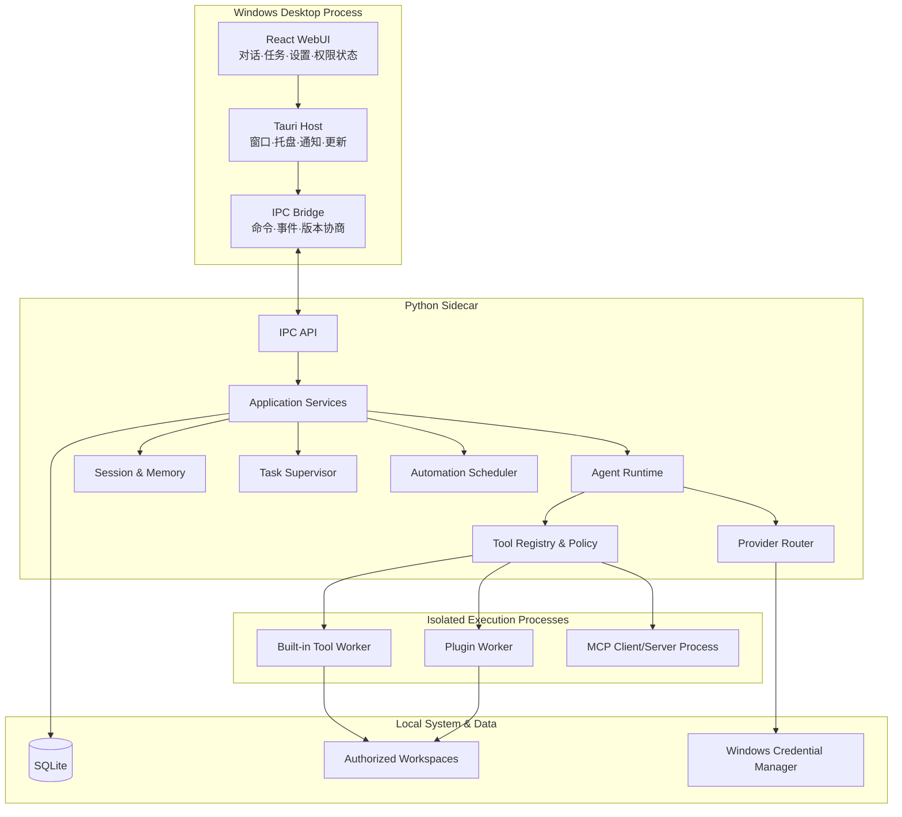

# Windows 本地智能体桌面应用架构设计规格

> 文档状态：已确认设计
>
> 适用对象：全新、独立实现的 Windows 桌面智能体产品
>
> 文档日期：2026-09-03

## 1. 文档定位

本文档描述一个可安装到 Windows 的本地智能体桌面应用。它是一份独立的、面向全新项目的架构规格，不依赖任何现有项目的代码、文件结构、接口或运行环境。其他项目仅作为设计经验来源，不构成本项目的运行时依赖或兼容性要求。

应用以现代桌面 GUI 为主要入口。模型推理、会话、记忆、自动化、子代理和工具执行均发生在用户电脑上；远程模型供应商仅接收必要的模型请求。应用继承当前 Windows 用户权限，不默认申请管理员权限。

本文档使用“Local Agent Desktop”作为产品代称，不限制最终产品名称。

## 2. 产品目标与边界

### 2.1 目标

第一版产品必须做到：

1. 用户可以通过 Windows 安装包安装、启动和卸载应用。
2. 用户可以在设置中配置自己的 OpenAI-compatible 或 Ollama 模型连接。
3. 用户可以选择一个或多个本地工作区，并在工作区中与 Agent 连续对话。
4. Agent 可以在授权范围内读取、搜索、创建和修改本地文件。
5. Agent 可以在用户显式批准后执行 PowerShell 或其他高风险操作。
6. Agent 可以创建最多三个并发子代理，协作完成当前任务。
7. 应用提供会话历史、工作区记忆和经用户批准的长期记忆。
8. Agent 可以提出自动化任务，经用户批准后由托盘进程定时执行。
9. 应用支持内置工具、Python 工具插件和 MCP 工具服务。
10. GUI、Sidecar 或工具进程异常退出后，不破坏会话数据，并能够安全恢复任务状态。

### 2.2 第一版非目标

第一版不实现：

- 多用户服务器、团队协作或租户隔离；
- macOS、Linux、移动端或浏览器独立运行；
- Windows Service 和用户退出登录后的后台运行；
- 默认管理员权限或无人值守的系统级修改；
- 云端会话同步、云备份和跨设备控制；
- 浏览器自动化、桌面视觉点击、邮件和云盘等外围集成；
- 多层递归子代理；
- 插件市场、在线支付或组织级策略中心；
- 依赖向量数据库的语义记忆检索。

### 2.3 已确认的产品决策

| 主题 | 决策 |
|---|---|
| 产品形态 | Windows 单用户桌面应用 |
| GUI | Tauri + React/TypeScript |
| Agent 后端 | Python Sidecar |
| 后台运行 | 关闭窗口后驻留托盘；退出登录或关机后停止 |
| 模型 | OpenAI-compatible API 与 Ollama |
| 文件边界 | 工作区白名单、越界授权、高风险二次确认 |
| 记忆 | 会话、工作区、用户长期记忆三层结构 |
| 子代理 | 单层，最多三个并发，共享工作区并使用路径写锁 |
| 自动化 | 单次、固定间隔、Cron；用户确认；只补最近一次错过的运行 |
| 插件 | Python 包 + Manifest；独立 Worker；MCP stdio/HTTP |
| 存储 | 本地 SQLite + Windows Credential Manager |
| 安全原则 | 默认安全模式；任意 Shell 与未签名插件属于高级能力 |

## 3. 总体架构

系统采用“模块化单体核心 + 少量隔离 Worker”：



### 3.1 核心原则

- Tauri 管理桌面生命周期和原生安全交互。
- React 负责展示与输入，不承载业务规则。
- Python Sidecar 是唯一业务后端，不拆成多个常驻微服务。
- Agent Runtime 是可独立测试的纯运行循环。
- 高风险工具和第三方插件通过独立进程执行。
- SQLite 是会话、任务和权限状态的本地事实来源。
- IPC 使用版本化契约，GUI 不依赖 Python 内部对象。
- 所有副作用都必须经过工具契约与权限策略。

## 4. 进程与信任边界

### 4.1 Tauri Host

Tauri Host 负责：

- 主窗口、托盘、系统通知和单实例锁；
- 启动、监控、重启和关闭 Python Sidecar；
- 安装更新和校验签名；
- 展示原生权限确认窗口；
- 通过受限命令暴露 Windows Credential Manager；
- 将 Sidecar 事件转发给 React。

React 页面不能直接启动任意进程、读取任意文件或访问凭据。Tauri capability 配置只开放明确需要的命令。

### 4.2 Python Sidecar

Sidecar 负责全部业务用例，包括 Agent 回合、模型调用、会话、记忆、工具策略、子代理和自动化。它不负责渲染 GUI，也不直接显示原生确认窗口。

生产环境优先使用命名管道通信。开发环境可以使用绑定到 `127.0.0.1`、带随机启动令牌的本地端口。生产环境不得监听局域网地址。

### 4.3 Tool Worker

Tool Worker 执行文件写入、Shell、Python 等可能阻塞或崩溃的内置工具。Worker 通过 Windows Job Object 管理进程树，并受到超时、输出上限和取消信号约束。

Tool Worker 的进程隔离主要用于稳定性和生命周期控制。除非另行使用 Windows AppContainer、受限令牌或低权限账户，否则它不是恶意代码安全沙箱。

### 4.4 Plugin Worker

第三方 Python 插件不得导入 Agent 主进程。每个插件或相互兼容的插件组由独立 Worker 加载，通过 JSON 消息协议调用。

安装未签名插件等同于允许第三方代码以当前 Windows 用户身份运行。GUI 必须明确展示此风险，不得用“已沙箱化”等误导性描述。

## 5. 仓库结构

```text
local-agent-desktop/
├── apps/
│   └── desktop/
│       ├── src/
│       │   ├── app/
│       │   ├── components/
│       │   ├── features/
│       │   │   ├── chat/
│       │   │   ├── sessions/
│       │   │   ├── automations/
│       │   │   ├── permissions/
│       │   │   ├── tools/
│       │   │   ├── memory/
│       │   │   └── settings/
│       │   ├── lib/
│       │   │   ├── ipc/
│       │   │   └── validation/
│       │   ├── stores/
│       │   └── types/
│       └── src-tauri/
│           ├── src/
│           │   ├── main.rs
│           │   ├── tray.rs
│           │   ├── sidecar.rs
│           │   ├── ipc_bridge.rs
│           │   ├── credentials.rs
│           │   └── updater.rs
│           ├── capabilities/
│           └── tauri.conf.json
├── backend/
│   ├── pyproject.toml
│   └── src/
│       └── local_agent/
│           ├── bootstrap.py
│           ├── config/
│           ├── ipc/
│           ├── application/
│           ├── runtime/
│           ├── providers/
│           ├── tools/
│           │   ├── builtin/
│           │   ├── policy/
│           │   ├── plugins/
│           │   └── mcp/
│           ├── agents/
│           ├── sessions/
│           ├── memory/
│           ├── automations/
│           ├── storage/
│           ├── security/
│           └── observability/
├── workers/
│   ├── tool_worker/
│   ├── plugin_worker/
│   └── protocol/
├── contracts/
│   ├── ipc/v1/
│   ├── plugin/v1/
│   └── generated/
│       ├── python/
│       └── typescript/
├── migrations/
├── tests/
│   ├── unit/
│   ├── integration/
│   ├── contract/
│   ├── security/
│   └── e2e/
├── packaging/
├── scripts/
└── docs/
```

### 5.1 依赖方向

允许的依赖方向是：

```text
desktop → IPC contracts → application → runtime/features → ports → adapters
```

约束如下：

- `runtime/` 不得导入 React、Tauri、SQLite 或具体 Provider SDK。
- `application/` 只能通过 Repository、Provider、Executor 等端口访问基础设施。
- `bootstrap.py` 是 Python 侧唯一组合根，负责实例化和连接实现。
- `contracts/` 是 Python、Rust、TypeScript 跨语言通信的唯一协议来源。
- Worker 只依赖工具协议和最小共享类型，不依赖完整 Agent 应用。
- 功能模块之间通过明确接口协作，不通过跨目录读取内部状态。

## 6. Python 模块职责

### 6.1 `ipc/`

定义 IPC 请求、响应、事件、错误封装、协议版本和重连补发。这里只做 DTO 校验与路由，不写业务判断。

### 6.2 `application/`

实现面向 GUI 的用例：

- 创建、继续、取消和恢复 Run；
- 创建、重命名、归档和删除会话；
- 添加和切换工作区；
- 审批权限与记忆提案；
- 管理自动化、Provider Profile、插件和 MCP；
- 将领域事件发布到 GUI。

### 6.3 `runtime/`

包含纯 AgentRunner、上下文组装接口、Hook、Checkpoint 数据结构和运行结果。它接收完整的 `RunSpec`，不自行读取配置或数据库。

### 6.4 `providers/`

包含 Provider 协议、能力模型、路由、重试策略、OpenAI-compatible Adapter 和 Ollama Adapter。

### 6.5 `tools/`

定义工具契约、注册表、参数校验、权限策略、执行路由、内置工具、插件适配和 MCP 适配。

### 6.6 `agents/`

管理主任务和子代理的并发、取消、状态、工具授权子集、结果回传和工作区路径锁。

### 6.7 `sessions/` 与 `memory/`

`sessions/` 保存事实性对话记录和摘要；`memory/` 保存可检索、可审批、可删除的用户或工作区知识。两者不能混为同一张“历史”表。

### 6.8 `automations/`

管理定时规则、下一次运行、补执行、执行历史和权限快照。自动化触发后创建普通 Run，不建立第二套 Agent 执行机制。

### 6.9 `storage/`、`security/` 与 `observability/`

- `storage/`：SQLite 连接、迁移、事务和 Repository 实现；
- `security/`：路径解析、权限决策、凭据引用、网络目标校验和审计；
- `observability/`：结构化日志、指标、诊断包和敏感信息清理。

## 7. 核心接口

### 7.1 Provider

```python
class ChatProvider(Protocol):
    capabilities: ProviderCapabilities

    async def generate(
        self,
        request: ModelRequest,
        on_delta: DeltaCallback,
        cancel: CancelToken,
    ) -> ModelResponse: ...
```

内部模型统一使用 `ModelRequest`、`ModelDelta`、`ModelResponse`、`ToolCall` 和 `Usage`，不在 AgentRunner 中出现供应商专属消息结构。

### 7.2 Tool

```python
class Tool(Protocol):
    spec: ToolSpec

    async def invoke(
        self,
        context: ToolContext,
        arguments: dict[str, object],
    ) -> ToolResult: ...
```

`ToolSpec` 至少包含：

- 唯一名称和用户可理解的描述；
- JSON Schema 输入定义；
- 风险等级；
- 所需 Capability；
- 执行位置；
- 并发策略；
- 是否幂等；
- 超时和最大输出。

### 7.3 Permission Policy

```python
class PermissionPolicy(Protocol):
    async def authorize(
        self,
        request: PermissionRequest,
    ) -> Allow | Deny | RequireUserConfirmation: ...
```

权限结果必须可审计，并绑定到具体工具、资源范围、会话、工作区和过期时间。

### 7.4 Repository 与事务

Application Service 通过 Repository 读写数据。跨 `runs`、`messages`、`tool_calls` 和 `audit_events` 的状态变化必须在一个短事务内提交。

## 8. Agent 回合模型

### 8.1 Run 类型与状态

Run 类型：

- `main`：用户直接发起；
- `subagent`：主代理派生；
- `automation`：调度器触发。

Run 状态：

```text
queued → running → waiting_permission / waiting_user
       → completed / failed / cancelled / recovering
```

所有状态变化必须持久化并产生事件。状态转换必须由 Application Service 执行，GUI 不能直接修改数据库状态。

### 8.2 单次回合流程

1. GUI 提交消息并获得 `run_id`。
2. Application Service 验证工作区、会话和 Provider Profile。
3. 在事务中保存用户消息，并创建 `pending` checkpoint。
4. Context Builder 组装系统提示、记忆、摘要、最近历史和工具定义。
5. AgentRunner 调用 Provider，并将文本增量发布到 GUI。
6. 模型请求工具时，先保存待执行 ToolCall。
7. Policy Engine 校验参数、路径、权限和风险。
8. 若需确认，Run 进入 `waiting_permission`；收到用户决定后继续。
9. Executor 执行工具，持续发布进度，并保存结果 checkpoint。
10. 工具结果返回 AgentRunner，继续模型—工具循环。
11. 产生最终回答后，在事务中保存消息、Usage、产物引用和最终状态。
12. 清除 checkpoint，发布 `run.completed`。

### 8.3 AgentRunner 约束

- 最大模型—工具迭代次数可配置，默认值应保守。
- 工具定义保持稳定排序，减少提示缓存波动。
- 工具结果必须做长度限制和结构化归一化。
- 工具参数错误作为可纠正结果反馈模型，不立即终止 Run。
- 基础设施崩溃、策略系统失败或数据库失败才触发致命错误。
- Provider、Tool 和子代理都必须响应同一个 CancelToken。
- 持久化消息不得被临时上下文压缩结果反向改写。

## 9. 上下文、会话与记忆

### 9.1 会话历史

会话历史保存原始用户消息、助手消息、工具调用及结果。上下文压缩生成新摘要，但不删除原始记录；用户删除会话时才执行明确的数据删除策略。

### 9.2 上下文组装顺序

模型输入按以下顺序和预算组装：

1. 核心系统提示和安全规则；
2. 当前运行环境与工作区说明；
3. 已批准且与当前任务相关的记忆；
4. 会话历史摘要；
5. 最近的合法消息后缀；
6. 当前用户消息；
7. 工具定义。

上下文预算必须为最终回复和工具结果预留空间。达到阈值时异步创建摘要，不应等到 Provider 拒绝请求后才处理。

### 9.3 三层记忆

| 层级 | 范围 | 写入规则 |
|---|---|---|
| 会话历史 | 单一 Conversation | 自动保存事实消息 |
| 工作区记忆 | 单一 Workspace | Agent 可提出，按策略自动或用户确认 |
| 用户长期记忆 | 跨工作区 | 必须用户确认 |

Agent 不直接修改记忆表，只能调用：

- `memory_read`：读取相关记忆；
- `memory_propose`：提出新增或更新；
- `memory_forget`：请求删除。

第一版使用 SQLite FTS5、作用域、时间、用户置顶和来源可信度组合排序。不得仅因为模型在对话中陈述某件事就将其视为长期记忆。

## 10. Provider 与模型设置

### 10.1 Provider Profile

每个 Profile 保存：

- `type`：`openai_compatible` 或 `ollama`；
- 显示名称；
- Base URL；
- 默认模型；
- timeout、temperature、max tokens；
- streaming、tool calling、vision 等能力标记；
- Credential Manager 凭据引用；
- 测试状态和最后测试时间。

### 10.2 API Key 流程

1. React 使用密码输入框接收 Key。
2. Key 通过专用 Tauri command 交给原生 Credential Broker。
3. Credential Broker 写入 Windows Credential Manager。
4. SQLite 只保存不可逆推出 Key 的凭据引用。
5. Sidecar 在发起模型请求时按 Profile 获取凭据，并仅短暂保存在内存。
6. API Key 不得进入事件流、日志、诊断包、崩溃报告或前端持久状态。
7. 保存成功后，GUI 只显示“已配置”，不得回显完整 Key。

### 10.3 连接测试

“测试连接”必须返回结构化结果：DNS/连接失败、认证失败、模型不存在、协议不兼容或成功。底层响应正文需脱敏和限长。

## 11. 工具体系

### 11.1 第一版内置工具

```text
list_files      read_file       write_file
edit_file       search_text     shell
memory_read     memory_propose  memory_forget
automation      spawn_agent     ask_user
```

`web_fetch` 可以作为可选内置工具，但必须包含私网、回环地址、链路本地地址和云元数据地址防护。

### 11.2 风险等级

| 等级 | 示例 | 默认策略 |
|---|---|---|
| `read` | 读取工作区文件 | 工作区内允许 |
| `write` | 新建或修改文件 | 展示变更范围，按用户策略确认 |
| `execute` | PowerShell、Python | 安全模式禁用；高级模式逐次确认 |
| `destructive` | 删除、覆盖大量文件 | 强制二次确认 |
| `elevated` | 安装程序、系统设置 | 第一版默认拒绝 |

### 11.3 执行位置

- `in_process`：纯内存、只读、快速且可信的工具；
- `tool_worker`：文件写入、Shell、Python 等内置副作用工具；
- `plugin_worker`：所有第三方 Python 插件；
- `mcp`：外部 MCP 服务。

### 11.4 并发策略

- `parallel`：可并行只读工具；
- `workspace_exclusive`：可能修改未知文件集合的工具，例如 Shell；
- `path_exclusive`：对已知文件路径加锁；
- `global_exclusive`：更新、迁移等全局操作。

## 12. 本机安全设计

### 12.1 工作区边界

文件工具必须：

1. 将用户输入转换为绝对规范路径；
2. 解析符号链接、Junction 和大小写差异；
3. 确认最终目标位于已授权根目录；
4. 对不存在的新文件校验其最近存在父目录；
5. 拒绝设备路径、UNC 越界路径和异常重解析点；
6. 在执行时再次检查，降低检查后替换风险。

### 12.2 Shell 的真实边界

仅设置工作目录不能限制 PowerShell 访问其他路径。因此：

- 安全模式默认不开放任意 Shell；
- 高级模式必须逐次展示完整命令、工作目录和环境影响；
- Shell 授权不应被描述为“仅能访问工作区”，除非已启用真正的 OS 沙箱；
- 应优先提供结构化工具，减少对任意 Shell 的依赖；
- 长期强隔离可以采用 AppContainer、受限令牌或独立低权限账户，但不属于第一版承诺。

### 12.3 文件与进程保护

- 写文件使用临时文件、flush 和原子替换；
- 删除默认移动到可恢复的应用回收区；
- Worker 使用 Job Object，取消时终止整个子进程树；
- 环境变量采用允许列表，Worker 默认拿不到 API Key；
- stdout/stderr 设置字节、行数和时间上限；
- 所有副作用记录到 AuditEvent。

### 12.4 IPC 与前端安全

- 生产 IPC 仅接受由 Tauri 启动并持有会话令牌的 Sidecar；
- 每个请求带版本、ID、来源和关联 ID；
- React 不能自行构造“已授权”结果；
- 权限确认由原生窗口生成并签名关联到 `permission_request_id`；
- WebView 使用严格 CSP，禁止任意远程脚本；
- 深链接、文件拖放和剪贴板内容都视为不可信输入。

## 13. 子代理设计

### 13.1 约束

- 全局最多三个并发子代理；
- 子代理不能再创建子代理；
- 每个子代理拥有独立 Run、上下文、Usage 和状态；
- 子代理只获得主代理授予的工具子集；
- 子代理默认共享当前工作区；
- 主 Run 取消时，所有未完成子 Run 一并取消。

### 13.2 工作区协调

已知写入路径使用规范化后的路径锁。父目录与子路径视为冲突。无法预测写入集合的 Shell 使用工作区独占锁。

路径锁用于减少协作冲突，不代替文件权限。Worker 崩溃或 Run 结束时，Supervisor 必须释放锁。

### 13.3 结果回传

子代理结果采用结构化对象：

- 任务 ID、标签和状态；
- 结论摘要；
- 已修改文件或生成产物；
- 使用的工具和 Usage；
- 错误与可恢复建议。

结果作为事件注入主 Run，由主代理统一汇报。子代理不能直接向主聊天追加最终助手消息。

## 14. 自动化设计

### 14.1 调度类型

- `at`：单次绝对时间；
- `every`：固定间隔；
- `cron`：Cron 表达式和明确时区。

### 14.2 创建与变更

Agent 可以提出创建、修改、启停或删除自动化，但必须由用户确认。GUI 展示自然语言说明、精确调度表达式、工作区、模型和权限快照。

### 14.3 执行模型

自动化保存：

- 提示词；
- 工作区；
- Provider Profile；
- 工具允许列表和权限快照；
- 调度、时区和错过执行策略；
- 并发策略和最长运行时间。

触发时创建 `automation` 类型 Run，复用普通 Agent Pipeline。不得保存或反序列化任意 Python callable。

### 14.4 生命周期

- Tauri 启动 Sidecar 后启动 Scheduler；
- 关闭主窗口时应用驻留托盘，Scheduler 继续运行；
- 用户明确“退出”时优雅取消或结束任务并 flush 数据；
- 用户退出登录、关机或进程未运行时不执行；
- 恢复后只补执行每个任务最近一次错过的 Run；
- 同一自动化默认不并发执行自身的多个实例。

## 15. 插件与 MCP

### 15.1 Plugin Manifest

每个插件包含 `plugin.toml`：

```toml
id = "example.tool"
name = "Example Tool"
version = "1.0.0"
protocol_version = 1
entrypoint = "example_tool:create_tools"
permissions = ["filesystem.read", "network.outbound"]
```

安装时验证唯一 ID、版本、协议、入口点和权限。权限变化视为重新授权，不能静默继承旧授权。

### 15.2 Worker 协议

启动流程：

1. Core 启动 Plugin Worker；
2. 双方交换协议版本和插件身份；
3. Worker 返回 Tool Schema；
4. Core 校验名称、Schema 和权限；
5. 调用只允许 JSON 可序列化参数与结果；
6. 超时或崩溃后终止 Worker；
7. 连续崩溃达到阈值后自动禁用插件。

### 15.3 MCP

第一版支持 stdio 和 HTTP。MCP 工具转换为内部 ToolSpec，统一经过权限、风险和审计系统。远程 MCP 服务器不得绕过网络目标校验和凭据隔离。

## 16. 本地数据模型

SQLite 启用 WAL、外键约束和版本化迁移。写操作经过单一 DatabaseWriter 队列，事务保持短小；读取可以使用独立连接并发执行。

| 表 | 关键字段 | 约束与用途 |
|---|---|---|
| `workspaces` | `id`, `path`, `display_name`, `granted_at` | 规范路径唯一 |
| `conversations` | `id`, `workspace_id`, `title`, `created_at`, `updated_at` | 会话归属工作区 |
| `messages` | `id`, `conversation_id`, `run_id`, `role`, `content_json`, `status`, `created_at` | 不可覆盖的事实消息 |
| `conversation_summaries` | `id`, `conversation_id`, `from_message_id`, `to_message_id`, `summary` | 仅用于上下文 |
| `runs` | `id`, `conversation_id`, `parent_run_id`, `kind`, `status`, `checkpoint_json`, `error_code` | 主任务、子代理、自动化统一模型 |
| `tool_calls` | `id`, `run_id`, `name`, `arguments_json`, `result_json`, `risk`, `status`, `idempotency_key` | 工具执行事实 |
| `memories` | `id`, `scope`, `workspace_id`, `content`, `source`, `approval_status`, `pinned` | 可审批、可删除 |
| `automations` | `id`, `workspace_id`, `schedule_json`, `prompt`, `provider_profile_id`, `permission_snapshot_json`, `enabled` | 调度定义 |
| `automation_runs` | `automation_id`, `run_id`, `scheduled_at`, `started_at`, `status` | 执行历史 |
| `provider_profiles` | `id`, `type`, `base_url`, `default_model`, `credential_ref`, `settings_json` | 不保存明文 Key |
| `permission_grants` | `id`, `capability`, `resource_pattern`, `scope`, `expires_at` | 精确授权 |
| `artifacts` | `id`, `run_id`, `path`, `media_type`, `size`, `sha256` | 生成文件引用 |
| `audit_events` | `id`, `run_id`, `event_type`, `subject`, `detail_json`, `created_at` | 安全审计 |
| `schema_migrations` | `version`, `applied_at`, `checksum` | 数据库版本 |

适合展示但不需要查询的内容可以使用 JSON；需要过滤、关联、唯一性或外键约束的字段必须使用普通列。

## 17. IPC 协议

### 17.1 请求

```json
{
  "version": 1,
  "request_id": "req_01",
  "method": "run.start",
  "params": {}
}
```

### 17.2 事件

```json
{
  "version": 1,
  "run_id": "run_01",
  "sequence": 17,
  "type": "tool.permission_requested",
  "payload": {}
}
```

每个 Run 的 `sequence` 单调递增。GUI 重连时调用 `events.since(run_id, sequence)` 补齐遗漏事件。React 状态不得只建立在未持久化的流式 delta 上。

### 17.3 核心命令

```text
app.get_state
workspace.list / workspace.add / workspace.remove
conversation.list / conversation.create / conversation.get / conversation.delete
run.start / run.cancel / run.resume / run.get
permission.resolve
memory.list / memory.approve / memory.forget
automation.list / automation.create / automation.update / automation.run
provider.list / provider.save / provider.test / provider.set_default
plugin.list / plugin.install / plugin.enable / plugin.disable
mcp.list / mcp.save / mcp.test
```

### 17.4 核心事件

```text
run.started
message.delta
message.completed
tool.requested
tool.permission_requested
tool.started
tool.progress
tool.completed
subagent.started
subagent.completed
artifact.created
run.waiting_user
run.completed
run.failed
run.cancelled
automation.triggered
provider.connection_changed
```

Python Pydantic 模型作为协议源，生成 JSON Schema 和 TypeScript 类型。Rust 侧只实现桥接所需的最小类型，不复制业务模型。

## 18. GUI 信息架构

### 18.1 主窗口

主窗口采用三栏：

- 左栏：工作区、新建会话、最近会话、自动化、工具与插件、记忆；底部固定设置入口；
- 中栏：会话标题、Provider/模型、安全模式状态、消息列表、工具摘要和输入框；
- 右栏：当前 Run 时间线、子代理、工具状态、产物和等待授权状态。

工具详细 stdout/stderr 默认折叠，不将聊天变成终端日志。用户可以从右栏查看完整审计详情。

### 18.2 设置页

第一版设置页包含：

- Provider Profile 列表；
- OpenAI-compatible/Ollama 类型选择；
- 显示名称、Base URL、API Key、默认模型和超时；
- 测试连接；
- 保存并设为默认；
- 安全模式开关及其清晰风险说明；
- 日志与诊断包入口。

### 18.3 权限体验

权限请求必须显示：

- 发起任务和工具；
- 精确命令或目标文件；
- 当前工作目录；
- 风险原因；
- “允许一次”“在当前范围允许”“拒绝”等选项；
- 授权有效期和可撤销入口。

危险操作使用 Tauri 原生窗口。应用不得允许模型生成的 Markdown 或 HTML 模拟授权界面。

### 18.4 可访问性与视觉基线

- 扁平、克制、内容优先，不依赖装饰性渐变和阴影；
- 使用语义设计 Token，并完整支持明暗主题；
- 所有操作支持键盘，焦点顺序符合视觉顺序；
- 图标有可访问名称，错误使用 `aria-live` 或等效机制播报；
- 颜色不是唯一状态信号；
- 尊重 reduced-motion；
- 流式消息和长工具输出使用虚拟化或增量渲染，避免阻塞 UI。

## 19. 错误处理与恢复

### 19.1 稳定错误码

跨 IPC 传递稳定错误码，例如：

```text
PROVIDER_TIMEOUT
PROVIDER_AUTH_FAILED
PROVIDER_MODEL_NOT_FOUND
TOOL_ARGUMENT_INVALID
PERMISSION_DENIED
WORKSPACE_BOUNDARY_VIOLATION
TOOL_PROCESS_CRASHED
PLUGIN_PROTOCOL_MISMATCH
DATABASE_BUSY
DATABASE_MIGRATION_FAILED
RUN_RECOVERY_REQUIRED
```

底层异常堆栈只写入脱敏日志，不直接暴露给模型或普通用户。

### 19.2 Checkpoint

至少在以下节点更新 checkpoint：

1. 工具调用已生成但尚未执行；
2. 每个工具执行完成；
3. 最终响应已持久化。

Sidecar 启动时将遗留的 `running` Run 置为 `recovering`。

### 19.3 重放策略

- 只读幂等工具可以自动重试；
- 原子文件写入可以通过目标哈希判断是否已经完成；
- Shell、删除、安装和未知插件调用不得自动重放；
- 非幂等调用必须再次获得用户确认；
- 每个 ToolCall 使用稳定 `idempotency_key`。

### 19.4 典型故障策略

| 故障 | 处理 |
|---|---|
| Provider 超时/限流 | 可取消退避；只重试模型请求 |
| 非法工具调用 | 返回校验错误让模型修正 |
| Tool Worker 超时 | 终止进程树并保存部分输出 |
| Sidecar 崩溃 | Tauri 限次重启；重复失败进入安全模式 |
| 插件重复崩溃 | 自动禁用并提示用户 |
| GUI 断开 | 后台继续，重连后补发事件 |
| 数据库迁移失败 | 恢复备份并阻止新版本继续写入 |
| 用户取消 | 取消向 Provider、子代理和 Worker 传播 |

## 20. 可观测性与诊断

日志采用结构化 JSON，并统一携带：

```text
request_id · run_id · conversation_id · tool_call_id · subagent_id
```

日志按大小轮转并限制保留周期。所有日志写入前经过敏感信息过滤；过滤器至少覆盖 API Key、Authorization Header、Credential 内容和常见密钥格式。

GUI 展示用户可理解的 Run 时间线。开发级堆栈、Provider 原始响应和 Worker stderr 只在诊断视图按需展开。

“导出诊断包”必须默认排除：

- API Key 和凭据；
- 未经用户选择的文件正文；
- 完整长期记忆；
- 任意可用于重放授权的令牌。

## 21. 测试策略

### 21.1 单元测试

- AgentRunner 的模型—工具循环、最大迭代和停止原因；
- Context Builder 的预算、排序和合法消息后缀；
- Provider 格式转换、能力检测、错误映射和重试；
- Tool Schema 校验和 ToolResult 归一化；
- 路径守卫、风险等级和 Permission Policy；
- 记忆审批、检索和遗忘；
- Cron、时区、休眠补执行计算；
- 路径锁冲突与释放。

### 21.2 契约测试

- Pydantic、JSON Schema、TypeScript 类型一致；
- IPC 请求、响应和事件向前兼容；
- Plugin Worker 握手和 Tool Schema；
- Provider 使用固定请求/响应 Fixture，不依赖真实密钥。

### 21.3 集成测试

- SQLite WAL、迁移、备份和并发写入；
- Credential Manager 保存、读取、替换和删除；
- Tauri 启动、重启和关闭 Sidecar；
- 权限确认的完整往返；
- Worker 超时与 Job Object 子进程树终止；
- checkpoint 在三个关键阶段的恢复；
- GUI 重连后的事件补发。

### 21.4 安全回归测试

- `..`、绝对路径、UNC、设备路径、符号链接和 Junction 越界；
- 检查后替换目标路径；
- 环境变量和日志泄露；
- 伪造 IPC 来源与重放授权；
- 恶意插件返回超大或非法消息；
- Shell 取消后残留子进程；
- WebFetch 对私网和元数据地址的访问。

### 21.5 端到端测试

至少覆盖：

1. 首次启动并配置 Provider；
2. 测试连接并选择默认模型；
3. 添加工作区并开始对话；
4. 批准文件修改和 Shell；
5. 创建子代理并查看结果；
6. 创建自动化、关闭窗口进入托盘并触发任务；
7. 重启 GUI 和 Sidecar 后恢复会话；
8. 卸载时保留或清除本地数据的用户选择。

## 22. 打包、更新与本地目录

### 22.1 打包

- React 构建产物打入 Tauri；
- Python Sidecar 第一版使用 PyInstaller 生成独立可执行文件；
- Tool Worker 和 Plugin Worker 与 Sidecar 使用相同 Python 运行时打包；
- Tauri 生成 Windows 安装包并携带所需二进制；
- 正式发行版本对安装包、Tauri 主程序和 Sidecar 做代码签名。

### 22.2 更新

- 更新清单必须签名；
- 更新前检查 Sidecar 和数据库 Schema 兼容性；
- 数据库迁移前生成备份；
- 迁移失败时恢复备份并阻止新版本写入；
- 插件协议升级必须保留明确的兼容版本范围。

### 22.3 本地数据位置

```text
%LOCALAPPDATA%\LocalAgent\
├── data\agent.db
├── logs\
├── plugins\
├── cache\
├── backups\
└── runtime\
```

用户项目文件保留在用户选择的工作区。API Key 存放在 Windows Credential Manager，不存放在上述目录。

## 23. 实施阶段

### 阶段 1：桌面与 Sidecar 骨架

- Tauri 单实例、窗口与托盘；
- Sidecar 启停和崩溃重启；
- 版本化 IPC；
- SQLite 初始化和迁移；
- React 基础布局。

验收结果：GUI 能可靠启动 Sidecar、读取应用状态并安全退出。

### 阶段 2：最小 Agent 与模型设置

- Provider Profile 设置页；
- Credential Manager；
- OpenAI-compatible 和 Ollama；
- 流式聊天；
- 纯 AgentRunner 和 Fake Provider 测试。

验收结果：用户可以使用自己的模型配置完成连续对话。

### 阶段 3：工具与权限

- 文件读取、搜索、写入和编辑；
- Tool Worker、PowerShell、超时和取消；
- 工作区路径守卫；
- 原生权限确认和审计。

验收结果：Agent 可以在明确授权范围内安全执行本地副作用。

### 阶段 4：会话与记忆

- 会话管理和历史恢复；
- 上下文预算和摘要；
- 工作区记忆；
- 长期记忆提案、审批和遗忘。

验收结果：长会话可持续使用，跨会话记忆完全可查看和控制。

### 阶段 5：子代理与自动化

- TaskSupervisor；
- 三个并发子代理和路径锁；
- 托盘 Scheduler；
- 自动化确认、执行历史和补执行。

验收结果：后台任务和子代理复用同一 Run、权限和恢复模型。

### 阶段 6：插件、MCP 与产品化加固

- Plugin Manifest 和 Worker；
- MCP stdio/HTTP；
- 崩溃隔离和自动禁用；
- 安装包、签名更新、诊断包；
- 完整安全和端到端回归测试。

验收结果：应用具备可控扩展能力，并满足正式发行条件。

## 24. 第一版完成标准

第一版同时满足以下条件才视为完成：

- Windows 安装、升级、卸载和单实例行为可靠；
- 关闭窗口后托盘继续运行，明确退出后所有状态安全落盘；
- 用户可以添加 OpenAI-compatible 或 Ollama Profile，并安全保存自己的 API Key；
- Agent 支持流式对话、工具调用、取消和恢复；
- 文件工具无法越过授权工作区；
- Shell 风险边界准确展示，不宣称不存在的沙箱能力；
- 最多三个子代理可并行运行且不会无提示覆盖同一文件；
- 三层记忆均可查看、审批和删除；
- 自动化可创建、启停、立即运行和查看历史；
- GUI 重连不会丢失关键事件；
- 非幂等工具不会在崩溃后自动重放；
- API Key 不出现在 SQLite、日志、诊断包和普通 IPC 事件中；
- 核心单元、契约、集成、安全和端到端测试通过。

## 25. 设计守则

后续实现与评审应持续遵循：

1. 保持 AgentRunner 小而纯粹，能力在 Provider、Tool 和 Application 边缘扩展。
2. 不为消除少量重复而引入复杂继承体系。
3. 所有配置显式建模，错误明确失败，不静默猜测。
4. 提示词不是安全边界；权限、路径和凭据必须由代码强制执行。
5. 独立进程不等于恶意代码沙箱，产品文案必须准确。
6. 会话记录、记忆、运行状态和日志承担不同职责，不混合存储。
7. 自动化、主任务和子代理共用同一 Run 模型和执行管线。
8. 先交付可验证的小闭环，再增加浏览器控制、云同步或插件市场。
